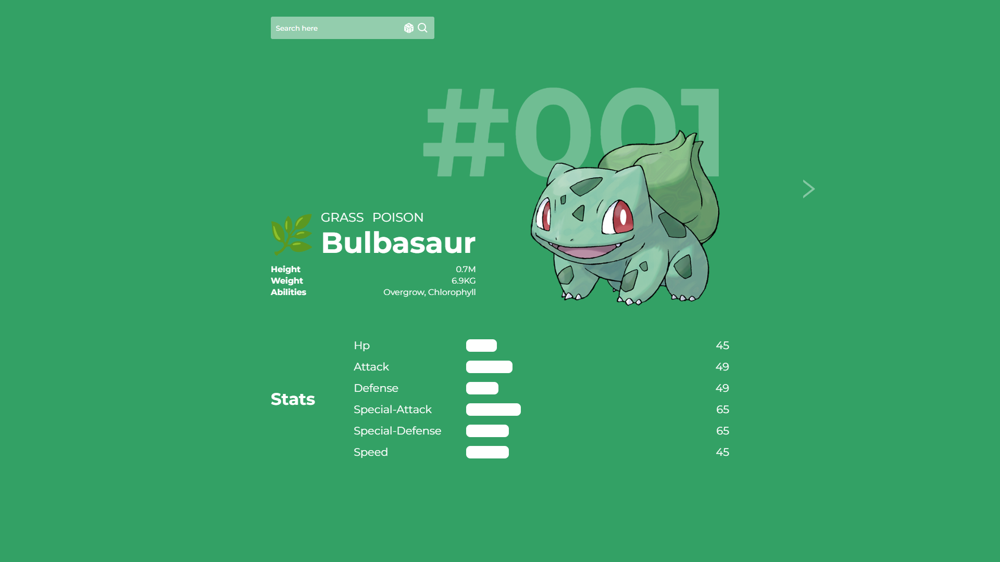

# Pokedex

<!---Esses são exemplos. Veja https://shields.io para outras pessoas ou para personalizar este conjunto de escudos. Você pode querer incluir dependências, status do projeto e informações de licença aqui--->

> Design da versão de PC.
### Ajustes e melhorias
O projeto ainda está em desenvolvimento e as próximas atualizações serão voltadas nas seguintes tarefas:

- [x] Sistema de pesquisa
- [x] Sistema de pokemon aleatório
- [ ] Deixar responsivo para mobile/tablet

## 🤝 Colaboradores

[Projeto feito com layout do Dribble](https://dribbble.com/shots/16191055-One-Page-PokeDex)

[⬆ Voltar ao topo](#Pokedex) 
